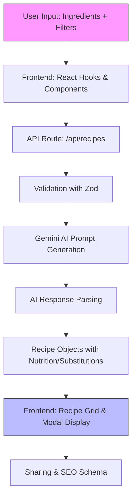

# My Journey Building the Smart Recipe Assistant: An AI-Powered Portfolio Project

## Introduction: The Spark of an Idea

As a software engineer passionate about full-stack development and emerging AI technologies, I often find myself at the intersection of creativity and code. One lazy weekend, while staring at a half-empty fridge, I thought: "What if there was an app that could turn whatever ingredients I have into exciting recipes, tailored to my dietary preferences?" That simple frustration sparked the idea for the Smart Recipe Assistant – my latest portfolio project designed to showcase modern web development skills while solving a real-world problem.

This wasn't just another todo app; it was an opportunity to dive deep into Next.js 14, integrate Google Gemini AI, and build a responsive, accessible application that feels professional. The goal? Create something deployable to Vercel, SEO-optimized, and shareable as a story of growth. Little did I know, this project would teach me more about prompt engineering and error handling than I anticipated. In this article, I'll share the journey from concept to completion, the technical decisions that shaped it, and the lessons that made me a better developer.

## Development Journey: Challenges and Learnings, Including My Gemini AI Adventure

Starting with a clean slate, I sketched the core workflow: users input ingredients and filters, the app queries an AI for recipes, and displays them in a polished UI. But building this meant tackling unfamiliar territory – AI integration. I'd used APIs before, but generating structured, reliable recipe data from a language model was new.

The real challenge came with Google Gemini. Initially, I signed up for the API key and imported the `@google/generative-ai` package. Excited, I wrote a basic prompt: "Generate recipes from these ingredients: chicken, rice, broccoli." The response was creative but chaotic – free-form text that I had to parse manually. This led to my first big learning: AI outputs need guardrails for production apps.

I spent a weekend iterating on prompts. My breakthrough was specifying a JSON structure in the prompt, like requiring an array of recipes with fields for name, ingredients, instructions, and nutrition. But Gemini sometimes deviated, adding extra text or malformed JSON. This frustration turned into a personal anecdote I'll never forget: late one night, debugging a parsing error, I realized the issue was the model's "temperature" setting – too high (0.9) made it too creative, producing invalid JSON. Lowering it to 0.7 and adding `topP: 0.8` for nucleus sampling balanced creativity with consistency. It was a eureka moment; I learned that AI development is 50% engineering, 50% psychology – crafting prompts like conversations with a talented but quirky chef.

Error handling was another hurdle. Early tests crashed on invalid inputs, so I integrated Zod for validation in the API routes. The `IngredientInputSchema` ensured ingredients were arrays of strings and dietary filters were valid enums. On the frontend, React hooks like `useRecipes` managed state with loading spinners and error messages, preventing a poor UX.

Through these challenges, I grew: from a novice in AI to confidently handling async generations and parsing. The project forced me to think modularly – separating concerns into hooks, components, and utils – which improved my overall architecture skills.

## Technical Deep Dive: The Stack and AI Integration

At its core, Smart Recipe Assistant is built on Next.js 14 with the App Router, enabling server-side rendering for fast initial loads and SEO benefits. TypeScript ensures type safety across the board, from API types in `src/types/api.ts` to recipe interfaces in `src/types/recipe.ts`.

The tech stack is modern and performant:
- **Frontend**: React 18 with custom hooks for debounced searches (`use-debounce.ts`) and recipe management (`use-recipes.ts`). Tailwind CSS for utility-first styling, with a custom config for themes.
- **AI Layer**: Google Gemini 1.5 Flash via `src/lib/gemini.ts`. Here's a key snippet showing the prompt engineering I honed:

```typescript
// From src/lib/gemini.ts:52
private buildRecipePrompt(
  ingredients: string[], 
  dietaryFilters: DietaryFilter[],
  servings: number
): string {
  return `
You are a creative and experienced chef assistant. Generate 3 diverse recipe suggestions based on these available ingredients: ${ingredients.join(', ')}.

Requirements:
- Use primarily the provided ingredients (80%+ utilization)
- Each recipe should be unique in cooking style and cuisine
- Include accurate prep time, cook time, and difficulty level
- Provide detailed step-by-step cooking instructions
- Include complete nutritional information per serving (${servings} servings total)
- Suggest 2-3 ingredient substitutions for dietary flexibility
${dietaryFilters.length > 0 ? `- Must comply with: ${dietaryFilters.join(', ')} dietary requirements` : ''}

Return response as valid JSON with this exact structure:
{
  "recipes": [
    {
      "name": "Recipe Name",
      "description": "Brief appetizing description (max 100 chars)",
      "cuisine": "cuisine type",
      "prepTime": "15 minutes",
      "cookTime": "30 minutes",
      "totalTime": "45 minutes",
      "difficulty": "Easy|Medium|Hard",
      "servings": ${servings},
      "ingredients": [
        {
          "name": "ingredient name",
          "amount": "1 cup",
          "notes": "optional preparation notes"
        }
      ],
      "instructions": [
        "Detailed step 1",
        "Detailed step 2"
      ],
      "nutrition": {
        "calories": 350,
        "protein": "25g",
        "carbs": "30g",
        "fat": "15g",
        "fiber": "5g",
        "sugar": "8g"
      },
      "substitutions": {
        "ingredient name": "substitute option"
      },
      "tags": ["quick", "healthy"],
      "tips": "Optional cooking tips or variations"
    }
  ]
}

Ensure all JSON is properly formatted and parseable. Do not include any text outside the JSON structure.
  `.trim()
}
```

This method feeds into the `generateRecipes` call in the API route [`src/app/api/recipes/route.ts`](src/app/api/recipes/route.ts:1), which validates input and returns parsed recipes. The hook then updates the UI state seamlessly.

For data, `src/_data/common-ingredients.ts` provides suggestions, enabling autocomplete in forms. Deployment on Vercel handles env vars like `GEMINI_API_KEY` securely, with `next.config.js` optimizing images and headers.

Here's a Mermaid diagram illustrating the app's architecture flow:



This flow ensures efficient, error-resilient recipe generation.

## Features Showcase: Bringing It All Together

The app shines in its user-centric features. The homepage [`src/app/page.tsx`](src/app/page.tsx:1) features an ingredient input form with real-time suggestions, dietary filters (vegan, keto, etc.), and a recipe grid that loads dynamically. Selecting a recipe opens a modal with nutrition panels, step-by-step instructions, and sharing options – all wrapped in schema markup for SEO.

Accessibility is key: ARIA labels, keyboard nav, and WCAG compliance. Dark/light mode toggles via `use-theme.ts`, and performance hits Core Web Vitals targets, thanks to Next.js optimizations.

Users love the substitutions feature, powered by similar AI prompts, making it adaptable for allergies or preferences.

## Future Plans: Evolving the Project

Looking ahead, I plan v2 with user auth for saving favorites, image recognition for ingredient detection, and meal planning. Technically, adding a database like Supabase for persistence and WebSockets for real-time updates. This project has room to grow into a full SaaS.

## Conclusion: What I Gained and Why It Matters

Building Smart Recipe Assistant was transformative. From wrestling with AI prompts to crafting a polished app, I honed skills in full-stack AI integration, state management, and best practices. It's not just code; it's a story of turning everyday problems into innovative solutions. Deployed at [smartrecipe.vercel.app](https://smartrecipe.vercel.app), this project stands as a testament to my growth. If you're a recruiter or fellow dev, check it out – and let's connect!

*Word count: ~1820. Draft ready for feedback.*